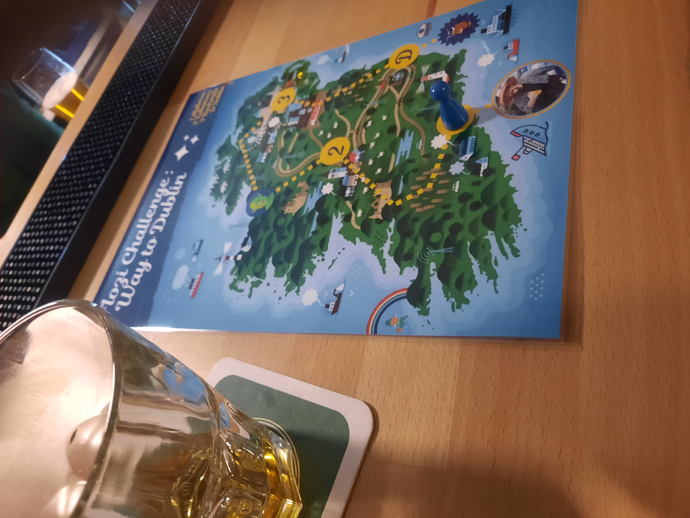

Every year Schwemme makes a special on St. Patricks day, with Guinness and Whiskey. During that time, guests are offered the chance to attempt the Flozie Challenge. This consists of drinking four whiskeys of increasing alcohol content and overcoming some challenges by the bartenders during the night. Without puking.

I can (more or less) proudly say to have attempted, survived and passed the challenge once. All three on one evening.

